# Hi, I'm Mirza Saikat Ahmmed 👋

  
  
  

 

## 🧑‍💻 About Me

- 🔭 Currently building **[Visual Marketing](https://visualmarketingny.com/)** — a Next.js + NestJS marketing site — and maintaining my open-source npm packages
- 👨‍💻 All of my projects are showcased at **[saikat.com.bd](https://saikat.com.bd/)**
- 📦 I publish and maintain developer tools on **[npm](https://saikat.com.bd/npm)** — see below
- 📝 I write about web development at **[saikat.com.bd/blog](https://saikat.com.bd/blog)**
- 💬 Ask me about **Next.js, NestJS, TypeScript, Prisma, PostgreSQL, .NET, or REST API design**
- 🎓 B.Sc. in Computer Science & Engineering, American International University-Bangladesh (AIUB)
- ⚡ Fun fact: I think I am funny

 

## 🛠️ Tech Stack

> Derived from 80+ personal repos and active work across Next.js / NestJS apps, Laravel, .NET APIs, Flutter clients, and CLI tools.

**Languages & runtimes**

**Frontend**

**Backend & APIs**

**Data & infra**

**Payment gateways** I've integrated before

  
  
  
  
  
  
  
  
  
  
  

 

## 📦 Featured npm Packages

| Package | Description |
|:---|:---|
| [**git-ai-pilot**](https://www.npmjs.com/package/git-ai-pilot) | Automated Git workflow with AI-generated commit messages and a built-in secret scanner |
| [**scribex-editor**](https://www.npmjs.com/package/scribex-editor) | A modern, feature-rich WYSIWYG editor for React built on TipTap and shadcn/ui |
| [**nestjs-api-forge**](https://www.npmjs.com/package/nestjs-api-forge) | Standardized API response formatting, error handling, and exception filters for NestJS |
| [**social-auth-unifier**](https://www.npmjs.com/package/social-auth-unifier) | Unified social auth (Google, Twitter, Facebook, LinkedIn, GitHub) for NestJS |
| [**nestjs-google-oauth**](https://www.npmjs.com/package/nestjs-google-oauth) | Google OAuth2 authentication strategy for NestJS |
| [**nestjs-twitter-oauth**](https://www.npmjs.com/package/nestjs-twitter-oauth) | Twitter/X OAuth2 authentication strategy for NestJS |

📊 Live download stats & full list: **[saikat.com.bd/npm](https://saikat.com.bd/npm)**

 

## 📊 GitHub Stats

 

## 🌐 Connect with me

